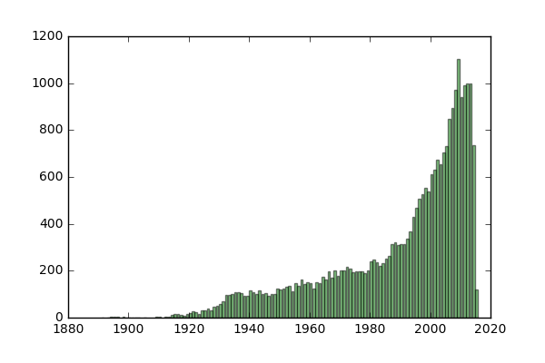
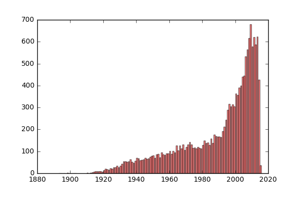
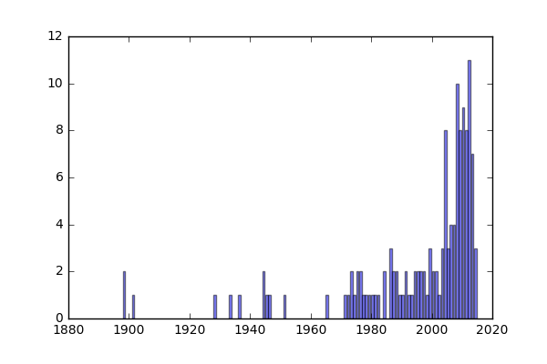
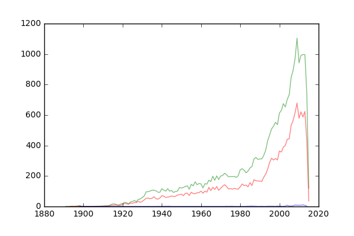
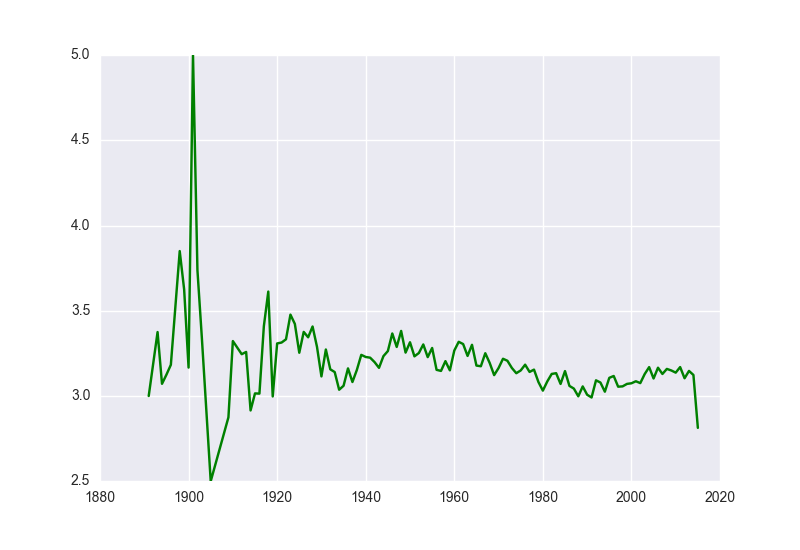
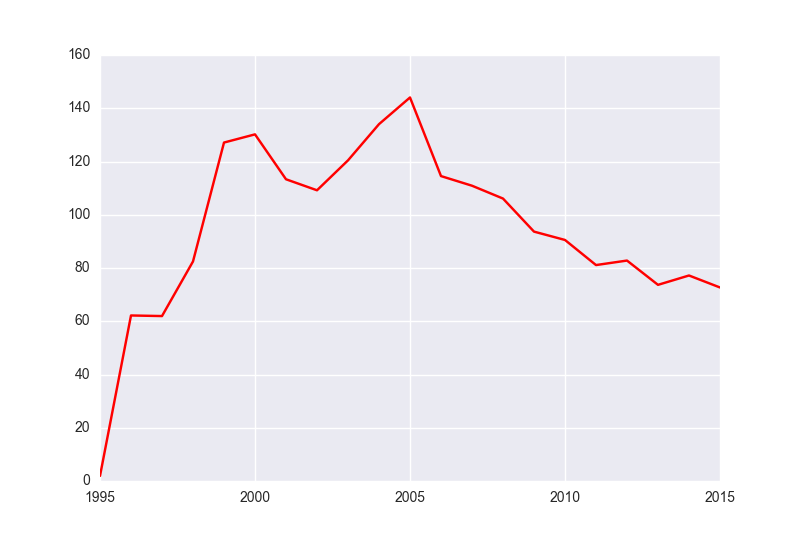
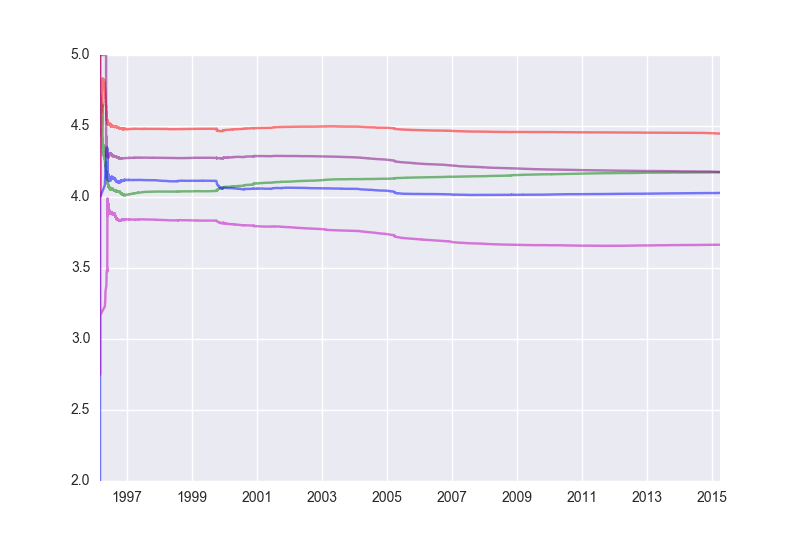
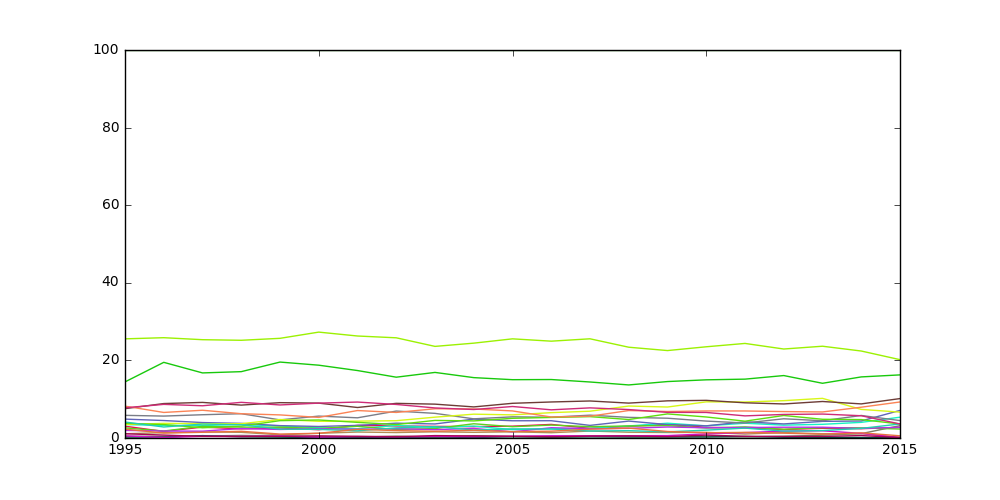
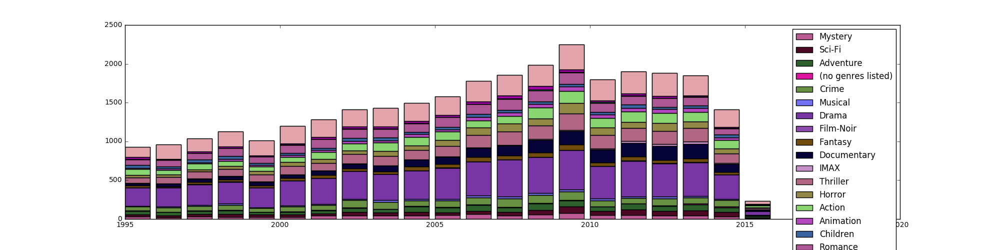
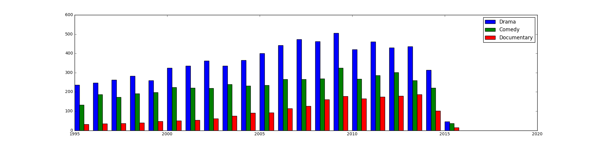

**Received  file size limit alert when trying to upload:**  
&nbsp;&nbsp;&nbsp;&nbsp;&nbsp;&nbsp;&nbsp;&nbsp;File final/data/ml-20m-dataset/ratings.csv is 508.73 MB; this exceeds GitHub's file size limit of 100.00 MB  
**Use txt file 'link_to_data.txt' in '/final/data' instead**

### Analysis 1. 

* I started with this analysis to get a general idea about ml-20m dataset and tried to get some interesting facts about movies.
* I performed some easy and simple calculations such as count the number of movies produced each year, count the number of movies rating > 3 and =5 each year.
* I've used matplotlib bar plot and line plot for each count to visualize the results.
* One interesting fact for above counts is that no matter how many movies were produced in a year, the movies that rates over three is always around half of all movies. In the contrast, movies with a round rating 5 (>4.5) is always rare. This can be caused by either the movie was really good that everyone likes it, or only a few people rated the movie.  

### Analysis 2. 

* This analysis focus on finding relationship between user participation and rating.
* I did some calculations such as yearly movie average rating (based on movie produced year), yearly average number of rating each user gave (based on user rating timestamp), and also analyze whether previous rating will influence the rest users.
* I've used and line plot for each of the questions.
* As the last graph in my notebook shows, after some big changes at the beginning, the change of average rating tend to be gentle. However, there are some little turns for each movie and after these little turns, movie's average rating tend to follow the turn (no matter it's going up or down). I would say that previous rating will influence how others going to rate the movie, but further validation requires more detailed analysis.  
 

### Analysis 3.

* This analysis focus on movie genres. I analyzed the quantity and percentage of each movie genre in year 1995-2005.
* For this question, I've used line plot, stacked bar chart and multiple bar chart.
* I was surprisingly found out that Drama and Comedy are the most popular genres and the trend keeps increasing. Also, even the quantity and percentage of Documentary is increasing and growing faster than Sci-Fi movies.  

### Analysis 4. 

* This analysis follows analysis_3 to further analyze the tag words in Drama and Comedy genres.
* The idea of this analysis was to find out which words were used more often for these genres and can better represent a genre.
* I used word cloud to show the results.  

### Analysis 5. 

* This analysis works on a bigger issue: if a user likes one movie(e.g.movieA), recommend five movies that the usesr might also like.
* I first found all users that liked movieA. Among these users, I then found all other movies liked by these them. Then based on movie's genre, the times each movie was liked, TMDb keyword relavance(fetchd from tmdb api), movie average score, calculate a final result.
* I was intended to use tag words at beginning, then I realize that the tag words were determined by user themselves and hard to represent a movie. So I turned to TMDb API. I downloaded data from TMDb API and stored in 'final/data/tmdb_movie_keyword_data' folder.
* Since downloading data is part of the analysis, I did not use a seperate notebook. Thus errors will occur if you are trying to use "run all" function of jupyter notebook. There are only around 10 lins left after collecting API data, please run them manually.

